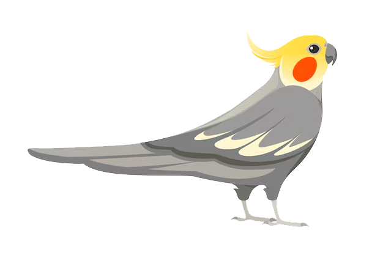

    

<h1> Hello < Developers/ >!  </h1>

 Hi! My name is Guilherme. Thank You for taking the time to view my GitHub Profile :smile: 

<h2> About Me </h2>

- 🎓 I’m graduated in Software Development
  
- 📝 I’m currently learning C#, Javascript and React
  
- 🔭 I’m looking to collaborate on projects
  
- 💬 Ask me about HTML and CSS
  
- 🎨 Fun fact: I'm also a designer.

<h2> Skills  </h2>

<h2> Connect with me  </h2>

 
  
 

-----
Credits: [Aditya Deshmukh](https://github.com/Aditya664)

Last Edited on: 01/01/2025